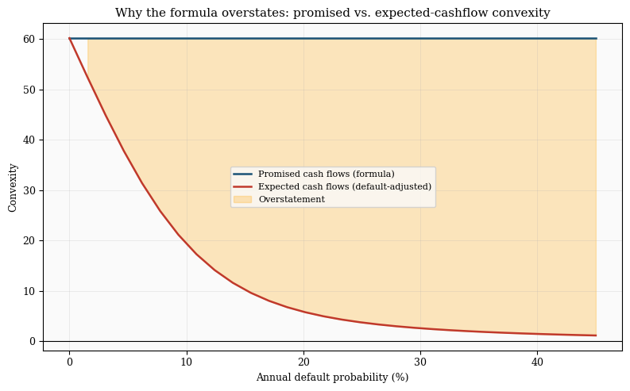
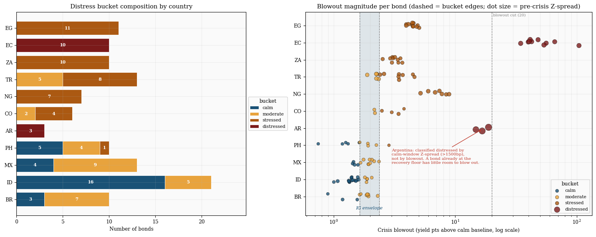

# Convexity Mispricing in EM Sovereign Bonds Under Stress

When emerging-market sovereign bonds come under credit stress, the textbook
closed-form **convexity** formula stops describing how their prices actually
behave. This project shows that the formula **systematically overstates**
convexity, that the overstatement **grows with credit stress**, and that the
cause is mechanical: the formula prices a bond's *promised* cash flows, while
the price responds to its *expected* (default-adjusted) ones.

The result is established three independent ways — from realized returns, from a
survival-weighted correction, and from pure cash-flow accounting — on a panel of
**117 bonds across 11 countries (58,489 bond-days)** spanning the COVID-19
credit shock.


> Formula convexity divided by realized convexity, per distress bucket. A value
> of 1.0 means the formula is right. It rises from **1.12** for calm bonds to
> **1.58** for distressed ones — the formula claims ~60% more curvature than
> distressed bonds actually deliver.

---

## What's in this repo

| File | Role |
|------|------|
| `data_pipeline.ipynb` | **Run first.** Builds the clean, analysis-ready panel from raw vendor exports. All data cleaning lives here. |
| `convexity_analysis.ipynb` | **Run second.** Consumes the pipeline output and does the entire analysis. Performs no cleaning of its own. |
| `panel_clean.csv` | Raw Refinitiv export (~115 EM sovereign bonds). *Pipeline input.* |
| `argentina_bonds.csv` | Raw Bloomberg export (3 Argentine bonds, different field schema). *Pipeline input.* |
| `panel_analysis.csv` | The harmonized panel the pipeline produces. *Analysis input.* |
| `output_convexity/` | Figures and CSV tables written by the analysis notebook. |

The two data sources are deliberately split: **Refinitiv** covers the bulk of
the universe, while **Argentina** comes from **Bloomberg** because its
Refinitiv analytics were dropped after the 2020 restructuring. The pipeline
reconciles the two onto one schema and one set of conventions before any
analysis happens.

---

## How to run

```
panel_clean.csv  ─┐
                  ├─►  data_pipeline.ipynb  ─►  panel_analysis.csv  ─►  convexity_analysis.ipynb  ─►  results
argentina_bonds.csv ─┘
```

**Order matters.** The analysis notebook reads `panel_analysis.csv` and will
not run without it.

1. **`data_pipeline.ipynb`** — run top to bottom. It will:
   - standardize types and harmonize the convexity scale (one vendor field
     arrives ~100× off, a known convention quirk);
   - drop rows past each country's 2020 restructuring cutoff, where vendor
     analytics reference cash-flow schedules that no longer exist;
   - recompute duration and convexity from cash flows on one locked convention
     (30/360 day count, periodic-yield modified duration, dirty-price
     convexity), so every bond is measured the same way;
   - flag and drop corrupt rows (e.g. duration exceeding time to maturity,
     which is mathematically impossible);
   - adapt the Bloomberg Argentina file onto the panel schema and merge it;
   - write **`panel_analysis.csv`**.

2. **`convexity_analysis.ipynb`** — run top to bottom. It reads
   `panel_analysis.csv`, drops bonds observed fewer than 60 times, classifies
   each remaining bond by how much stress it took, and produces the results
   below. (The 118-bond panel becomes the **117-bond, 58,489-row** analysis
   sample after this filter.) Figures and tables are written to
   `output_convexity/`.

**Requirements:** Python 3.11+, with `numpy`, `pandas`, and `matplotlib`. No
other dependencies.

---

## Main results

### 1. The formula overstates convexity, and it gets worse with stress

Each bond's *realized* convexity is backed out of its daily returns: the part of
the return that duration alone misses equals ½·C·dy² to second order, so
regressing that residual on ½·dy² through the origin recovers C. This is robust
where the naive approach (fitting a parabola to the price–yield cloud) explodes —
a calm bond whose yield barely moved produced a nonsensical convexity of 977
under the parabola fit.

Comparing formula convexity to this realized convexity, bucket by bucket:

| Bucket | Bonds | Formula C | Realized C | **Overstatement** |
|--------|------:|----------:|-----------:|------------------:|
| calm | 28 | 215.9 | 192.0 | **1.12×** |
| moderate | 32 | 92.3 | 73.2 | **1.12×** |
| stressed | 41 | 65.7 | 57.4 | **1.35×** |
| distressed | 13 | 31.6 | 20.6 | **1.58×** |

The overstatement is monotone in credit stress. A risk manager hedging with
formula convexity would systematically overestimate the second-order price
protection a distressed bond provides — exactly when that protection matters
most.

### 2. A default-adjusted convexity largely fixes it

If the formula misprices because it ignores default, building default back in
should help. Recomputing convexity from **survival-weighted** cash flows — where
each coupon is received only if the issuer hasn't defaulted, with the hazard
rate read from the bond's own Z-spread — pulls the measure toward the realized
value and, more importantly, **strips out the credit-quality tilt**:


The standard formula's error grows across buckets (spread of **0.46** between
calm and distressed). The adjusted measure is nearly flat across buckets
(spread as low as **0.03**). A predictable bias can be lived with; a
credit-varying one cannot — and the adjustment removes the varying part. This
holds in *direction* across every recovery assumption tested, so it isn't an
artifact of one lucky parameter choice.

### 3. The mechanism, with zero estimation

The empirical results can be argued with on estimation grounds. This last piece
cannot — it's pure accounting. For one stylized bond, compute convexity twice as
default probability rises: once from promised cash flows (what the formula does),
once from expected cash flows (what reality does).



The promised-cash-flow convexity (blue) is essentially flat in credit quality.
The expected-cash-flow convexity (red) falls as default risk rises. The wedge
between them is the overstatement — not measured here, but *derived*. The
formula isn't computing convexity incorrectly; it's computing the convexity of
the wrong cash flows.

### The honest tail

A recovery floor flattens the price–yield curve but does not, for a plain bullet
bond, generically invert it into *negative* convexity — that requires an upside
cap (callable bonds, MBS). The data agrees: only **2 of 117** bonds show
negative realized convexity, both driven by a handful of extreme days near a
restructuring rather than genuine structural concavity. They are reported as
edge cases, not as the result. The defensible, general claim is **proportional
overstatement**.

---

## How bonds are classified



Stress is measured per bond as **blowout** — how far its crisis-peak yield rose
above its own pre-crisis baseline — with cutoffs anchored on how
investment-grade sovereigns (which can't really default) behaved. A second
**level clause** catches bonds already trading at distressed spreads before the
crisis, which have little room left to blow out; this is what classifies the
three Argentine bonds. Both thresholds sit inside empty gaps in the data, so the
classification is pinned by the sample rather than by hand-chosen numbers.

---

## Notes and caveats

- **All duration/convexity values used in the analysis are formula-computed**
  from cash flows on a single locked convention. Vendor analytics are used only
  to validate that implementation in the pipeline; they are not carried into
  the analysis.
- The survival adjustment uses the **credit-triangle approximation**
  (spread ≈ hazard × (1 − recovery)) and assumes a flat hazard and constant
  recovery. Recovery is unobservable, which is why the analysis sweeps it rather
  than claiming a single value. A modest residual gap remains and is consistent
  with a liquidity premium plus the linearization — separating those is left to
  future work.
- The pipeline expects the raw Refinitiv export at `panel_clean.csv`. If you
  only have `panel_analysis.csv`, you can skip straight to the analysis
  notebook.
